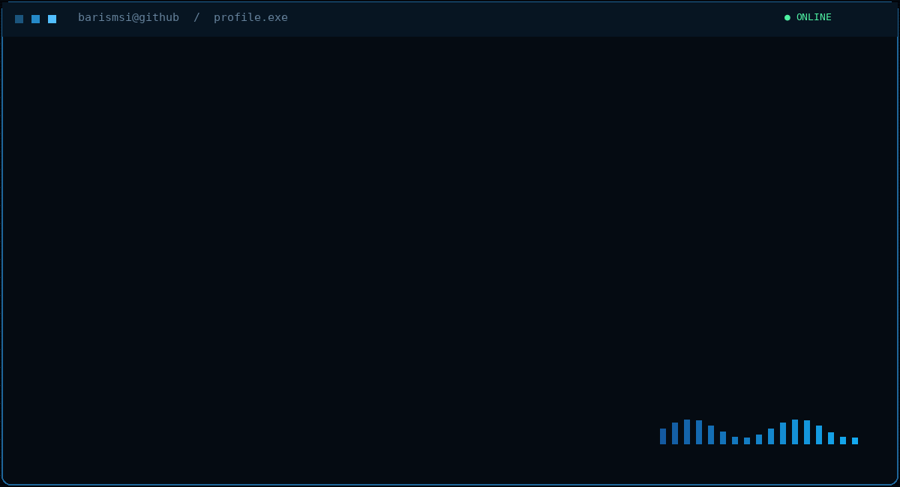
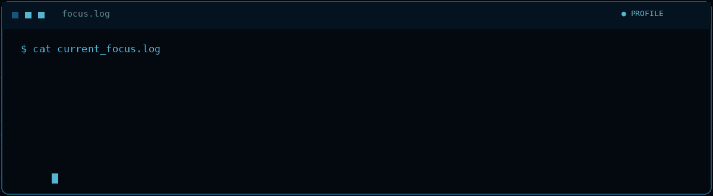
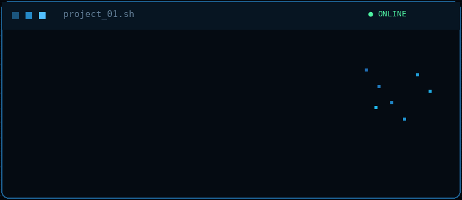
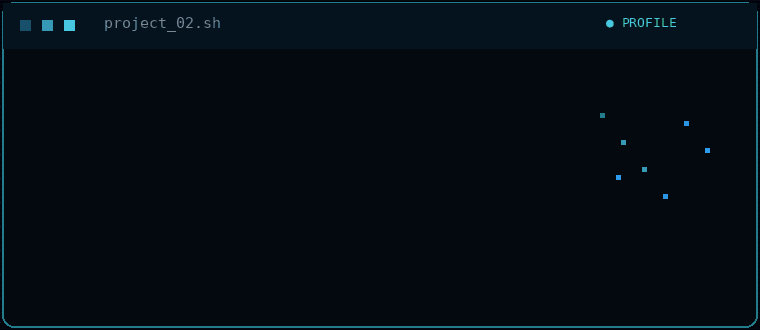
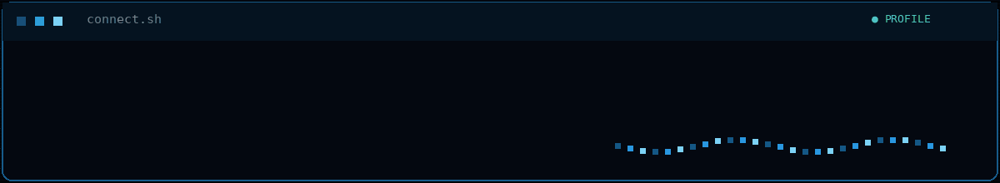

<div align="center">



### `C# learner` · `Python builder` · `Blender creator`

[`> ABOUT`](#about-terminal) &nbsp; [`> CURRENT FOCUS`](#current-focus) &nbsp; [`> PROJECTS`](#featured-projects) &nbsp; [`> CONNECT`](#connect)

</div>

<br>

## About terminal

```console
barismsi@github:~$ whoami
Barış — a curious developer in progress.

barismsi@github:~$ mission
Understand the logic. Build the idea. Refine the experience.
```

I'm currently learning **C# from the ground up**. I also use **Python** to create practical tools for **Blender**, combining code with my background in animation and visual production.

<br>

## Current focus



```csharp
while (curious)
{
    Learn();
    Build();
    Improve();
}
```

<details>
<summary><code>$ show learning_route</code></summary>

| Active now | Loading next |
| :--- | :--- |
| Variables and data types | Conditions and loops |
| Small C# exercises | Methods and problem solving |
| Reading each line with intent | Object-oriented programming |

</details>

<br>

## Featured projects

<p align="center">
  <a href="https://github.com/barismsi/MineShader-Enhancer"></a>
  <a href="https://github.com/barismsi/barismsi-color-reveal"></a>
</p>

These projects are where **Python and Blender** meet: tools built to improve creative workflows and give visual ideas more control.

<br>

## Connect



<div align="center">

[`LINKEDIN`](https://www.linkedin.com/in/barismsi) &nbsp; · &nbsp; [`INSTAGRAM`](https://www.instagram.com/barismsi) &nbsp; · &nbsp; [`ALL REPOSITORIES`](https://github.com/barismsi?tab=repositories)

<br>

<code>STATUS: LEARNING / BUILDING / STILL CURIOUS</code>

</div>
