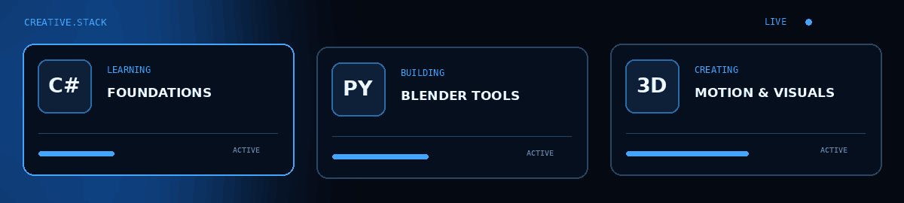
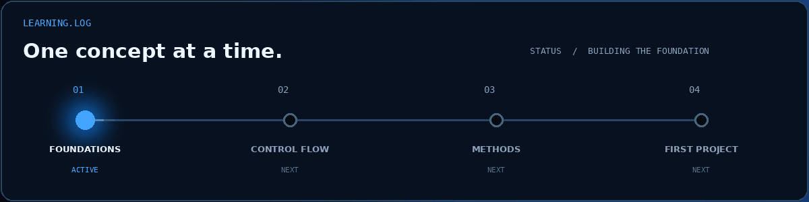
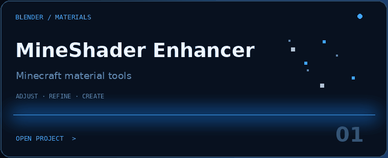
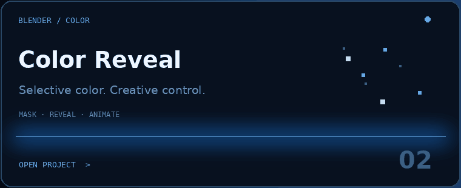
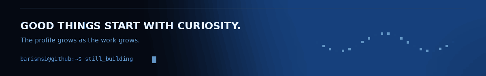

<div align="center">


**C# LEARNER** &nbsp; / &nbsp; **PYTHON BUILDER** &nbsp; / &nbsp; **BLENDER CREATOR**

[Projects](#03--the-creative-workbench) &nbsp; · &nbsp; [Learning](#02--one-concept-at-a-time) &nbsp; · &nbsp; [LinkedIn](https://www.linkedin.com/in/barismsi) &nbsp; · &nbsp; [Instagram](https://www.instagram.com/barismsi)

</div>

<br>

## 01 / Behind the screen

I'm **Barış**. I'm learning how to turn ideas into programs with **C#**, while using **Python** to build practical tools for my creative work in **Blender**.

I like understanding how things work—and taking care of how they look. This profile is where logic, motion, and visual craft meet.



```csharp
// About.cs — the current chapter
string focus = "C# fundamentals";
string mindset = "Learn it. Try it. Understand it.";

Console.WriteLine("Building my next chapter.");
```

<br>

## 02 / One concept at a time



| Exploring now | On the horizon |
| :--- | :--- |
| Variables · data types · small exercises | Conditions · loops · methods · OOP |

<details>
<summary><b>A note on the journey</b></summary>

I'm at the fundamentals stage. As I learn, I want to build small projects I can explain, improve, and share here. This space will grow with the work.

</details>

<br>

## 03 / The creative workbench

Sometimes a project starts with code. Sometimes it starts with a scene, a material, or an animation idea. I enjoy the space where both sides meet.

<a href="https://github.com/barismsi/MineShader-Enhancer"></a>
<a href="https://github.com/barismsi/barismsi-color-reveal"></a>

**MineShader Enhancer** is a Python-powered Blender material workflow tool. **Color Reveal** is my selective-color add-on project for Blender.

<br>

<div align="center">



Code, creative tools, or a shared interest—let's connect.

**[LinkedIn ↗](https://www.linkedin.com/in/barismsi)** &nbsp;&nbsp; **[Instagram ↗](https://www.instagram.com/barismsi)** &nbsp;&nbsp; **[Repositories ↗](https://github.com/barismsi?tab=repositories)**

<sub>BARISMSI &nbsp; / &nbsp; FROM PIXELS TO PROGRAMS</sub>

</div>
