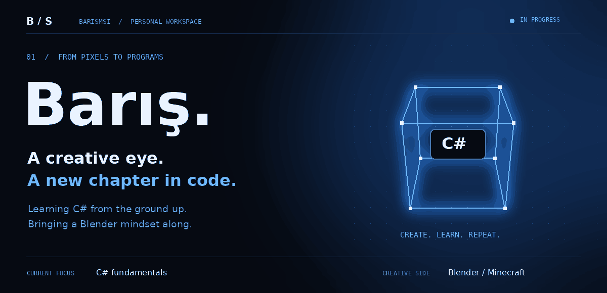

<div align="center">



**C# learner · Curious builder · Blender creator**

[Explore my projects](https://github.com/barismsi?tab=repositories) · [LinkedIn](https://www.linkedin.com/in/barismsi) · [Instagram](https://www.instagram.com/barismsi)

</div>

<br>

### 01 / About.cs

```csharp
string name = "Barış";
string currentFocus = "C# fundamentals";
string creativeSide = "Blender & Minecraft";

Console.WriteLine("Building my next chapter.");
```

I'm learning C# from the ground up: understanding the basics, writing small programs, and getting better through practice. I enjoy the logic behind software as much as the visual details that give a project its personality.

<br>

### 02 / Learning.log

| Working on now | Coming next |
| :--- | :--- |
| Variables and data types | Conditions and loops |
| Small C# exercises | Methods and problem solving |
| Understanding what each line does | Object-oriented programming |

**Current chapter:** fundamentals. One concept, one experiment, one step forward.

<br>

### 03 / Beyond the editor

My creative side lives in Blender: Minecraft scenes, animation, and tools that make the process more enjoyable.

| Project | What it's about |
| :--- | :--- |
| **[MineShader Enhancer ↗](https://github.com/barismsi/MineShader-Enhancer)** | A Blender tool for adjusting Minecraft material subsurface settings. |
| **[Color Reveal ↗](https://github.com/barismsi/barismsi-color-reveal)** | My Blender color-reveal project. Repository setup in progress. |

<br>

---

<div align="center">

**From pixels to programs.**

Learning in public. Making things along the way.

[github.com/barismsi](https://github.com/barismsi)

</div>
